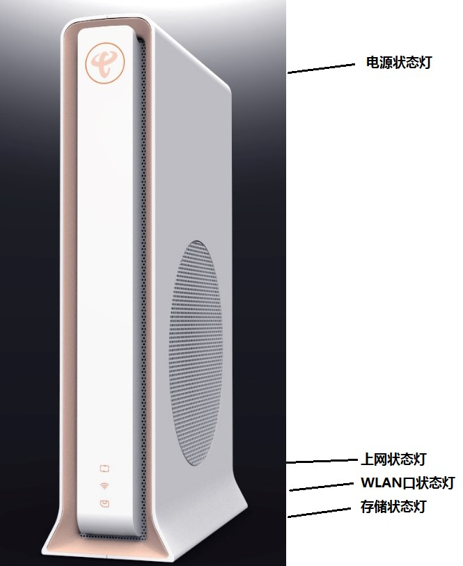

# E-140W-P
本工具用来提取 E-140W-P 光猫（以及类似型号）的超级管理员(telecomadmin)的密码

A tool for extracting E-140W-P Gateway's Telecomadmin account's password.

---
需要 Python3.2+

Requires Python3.2+

### 免责声明

**本工具**是一个开源免费的光猫超级密码查看工具，旨在帮助用户在合法和正当的情况下管理自己的网络设备。使用本工具前，请仔细阅读以下免责声明：

1. **开源免费**：本工具为开源免费软件，用户可以自由下载和使用，但不得用于任何非法目的。
2. **合法使用**：用户必须确保在合法授权范围内使用本工具，不得用于非法侵入或破解他人网络设备。
3. **无技术支持**：作为开源免费工具，我们不提供任何形式的技术支持，用户在使用过程中遇到的问题需要自行解决。
4. **风险自担**：用户在使用本工具过程中，因操作不当或误操作导致的任何网络故障或设备损坏，由用户自行承担全部责任。
5. **免责声明**：本工具的提供者不承担因使用本工具而产生的任何直接、间接、附带的或惩罚性的损害赔偿。

请在使用本工具前，确保您已充分理解并同意上述条款。若不同意，请勿使用本工具。

---

### Disclaimer

**This tool** is an open source, free optical modem super password viewer designed to assist users in managing their network devices within the scope of legality and legitimacy. Before using this tool, please read the following disclaimer carefully:

1. **Open Source and Free**: This tool is open source and free software, which users can freely download and use, but it must not be used for any illegal purposes.
2. **Legal Use**: Users must ensure that they use this tool within the scope of legal authorization and must not use it for illegal intrusion or cracking of other people's network devices.
3. **No Technical Support**: As an open source and free tool, we do not provide any form of technical support, and users need to resolve any issues encountered during use on their own.
4. **Risk Assumption**: Any network failure or device damage caused by improper or incorrect operation during the use of this tool shall be borne by the user.
5. **Liability Disclaimer**: The provider of this tool does not assume any liability for any direct, indirect, incidental, or punitive damages arising from the use of this tool.

Please ensure that you fully understand and agree to the above terms before using this tool. If you do not agree, please do not use this tool.
